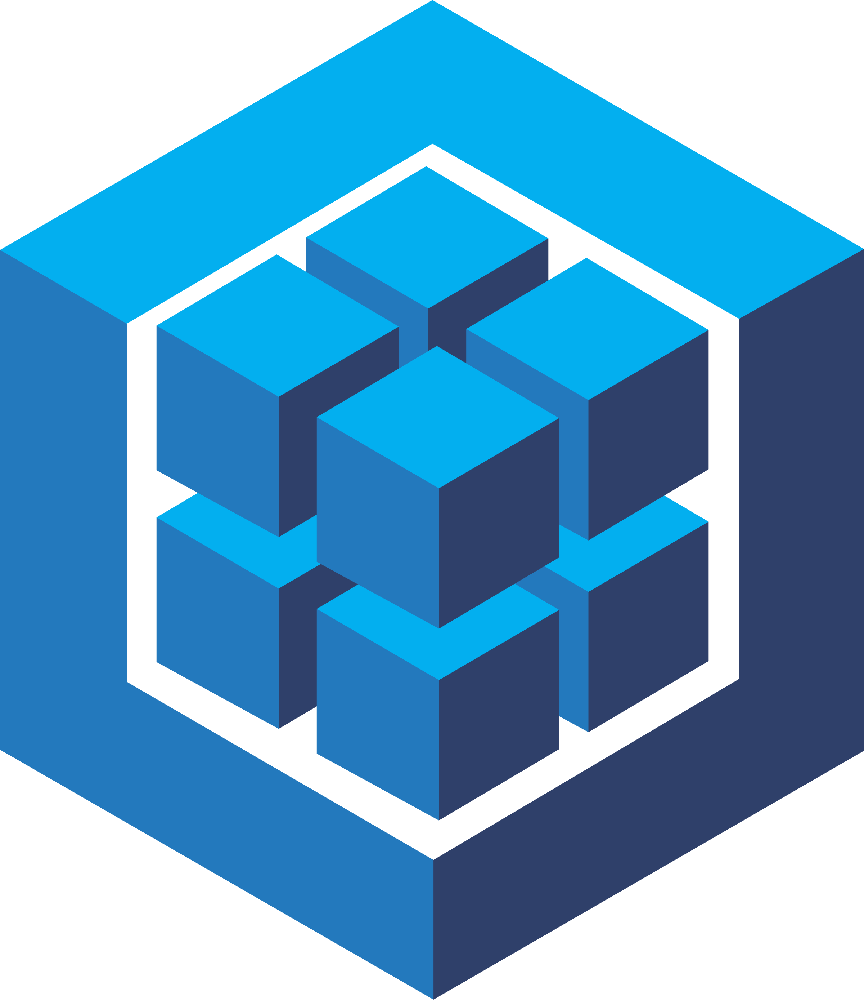
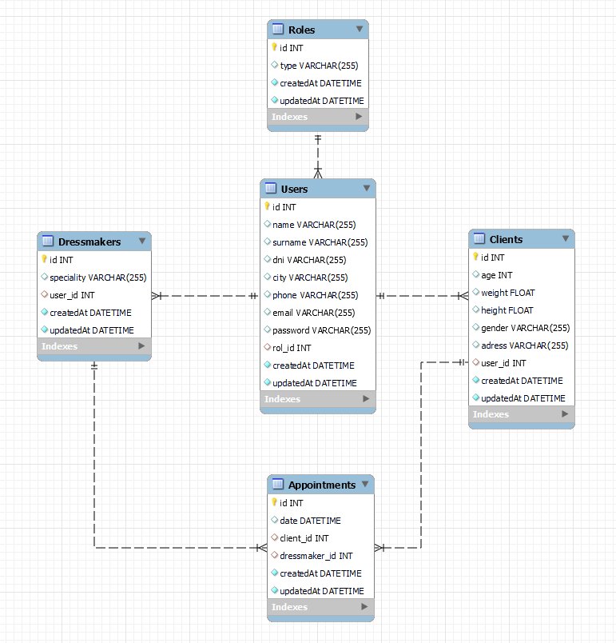

<h1 align="center"> L'agulla de cosir </h1>

<details>
  <summary>Contenido 📝</summary>
  <ol>
    <li><a href="#objetivo">Objetivo</a></li>
    <li><a href="#sobre-el-proyecto">Sobre el proyecto</a></li>
    <li><a href="#stack">Stack</a></li>
    <li><a href="#diagrama-bd">Diagrama</a></li>
    <li><a href="#instalación-en-local">Instalación</a></li>
    <li><a href="#endpoints">Endpoints</a></li>
    <li><a href="#futuras-funcionalidades">Futuras funcionalidades</a></li>
    <li><a href="#contribuciones">Contribuciones</a></li>
    <li><a href="#licencia">Licencia</a></li>
    <li><a href="#webgrafia">Webgrafia</a></li>
    <li><a href="#contacto">Contacto</a></li>
  </ol>
</details>

## Objetivo :dart:
Este proyecto requería crear un backend correspondiente al sistema de gestión de citas para una tienda de indumentaria valenciana.


## Sobre el proyecto :file_folder:
El proyecto consiste en crear una página web de una tienda especializada en indumentaria fallera, tanto femenina como masculina.
Lo que se pretende con este proyecto es que los clientes tengan la facilidad y comodidad de reservar cita con las y los indumentaristas en el momento que desee, sin tener que esperar a llamar por teléfono en horario comercial. 

## Stack :paperclip:
Tecnologías utilizadas:
<div>
<a href="https://sequelize.org//">
    
</a>
<a href="https://www.expressjs.com/">
    
</a>
<a href="https://nodejs.org/es/">
    
</a>
<a href="https://developer.mozilla.org/es/docs/Web/JavaScript">
    
</a>
 </div>


## Diagrama BD :chart_with_upwards_trend:


## Instalación en local :electric_plug:
1. Clonar el repositorio
2. Instalar dependencia y librerias
```
    ` $ npm i express nodemon dotenv mysql2 sequelize sequelize-cli bcrypt jsonwebtoken `
```
3. Conectar el repositorio con la base de datos 
```
    `$ npm sequelize-cli db:create`
```
4.  Ejecutar las migraciones
```
    `$ npx sequelize-cli db: migrate`
```
5.  Ejecutar los seeders 
```
    `$ npx sequelize db:seed:all`
```
6.  Levantar el servidor
```
    `$ npm run dev` 
```

## Endpoints :pushpin:
<details>
<summary>Endpoints</summary>

- AUTH
    - REGISTER

            POST localhost:5000/auth/register
        body:
        ``` js
            {
                "name": "Alberto",
                "surname": "López",
                "DNI": "11111111A",
                "city": "València",
                "email": "alberto@alberto.com",
                "phone": "66666666",
                "password": "123456",
                ,
            }
        ```

    - LOGIN

            POST localhost:5000/auth/login
        body:
        ``` js
            {
                "user": "Alberto",
                "email": "alberto@alberto.com",
                "password": "123456"
            }
        ```

- USER 

    - PROFILE  
            GET localhost:5000/user/profile

    - UPDATE PROFILE 
            PUT localhost:5000/user/update
        body:
        ``` js
            {
            "name": "Alberto",
            "surname": "López",
            "city": "València",
            "phone": "66666667",
            "email": "alberto@alberto.com",
            }
        ``` 
    - DELETE PROFILE
            DELETE localhost:5000/user/delete/:id

- APPOINTMENT

    - CREATE APPOINTMENTS 
            POST localhost:5000/appointment/create
        body:
        ``` js
            {
            "date": "2023-03-06 12:00:00",
            "dressmaker_id": 1,
            "client_id": 3,
            }
        ``` 

    - UPDATE APPOINTMENTS  
            PUT localhost:5000/appointment/update:id
        body:
        ``` js
            {
            "date": "2023-03-20 14:00:00",
            "dressmaker_id": 1,
            }
        ``` 
    - DELETE APPOINTMENT
            GET localhost:5000/appointment/delete/:id

    - CLIENT APPOINTMENT
            GET localhost:5000/appointment/getClient

    - DRESSMAKER APPOINTMENT
            GET localhost:5000/appointment/getDressmaker

    - ALL APPOINTMENT
            GET localhost:5000/appointment/getAll

- ADMIN

    - CREATE DRESSMAKER 
            POST localhost:5000/admin/createDressmaker
        body:
        ``` js
            {
            "speciality": "traje huertana",
            "image_url": "http://imagen_dressmaker_traje_huertana",
            "user_id": 9,
            }
        ``
</details>

## Futuras funcionalidades :pencil:
-  Eliminar perfil Dressmaker  

## Contribuciones :mailbox:
Las sugerencias y aportaciones son siempre bienvenidas.  

Puedes hacerlo de dos maneras:

1. Abriendo una issue
2. Crea un fork del repositorio
    - Crea una nueva rama  
        ```
        $ git checkout -b feature/nombreUsuario-mejora
        ```
    - Haz un commit con tus cambios 
        ```
        $ git commit -m 'feat: mejora X cosa'
        ```
    - Haz push a la rama 
        ```
        $ git push origin feature/nombreUsuario-mejora
        ```
    - Abre una solicitud de Pull Request

## Licencia :scroll:
Este proyecto se encuentra bajo licencia de MIT License

## Webgrafia :books:
Para conseguir nuestro objetivo hemos recopilado información de:

- <a href="https://sequelize.org">Sequelize</a>

- <a href="https://stackoverflow.com">Stackoverflow</a>


## Contacto :email:

· Paula Ribelles: ricam.paula@gmail.com